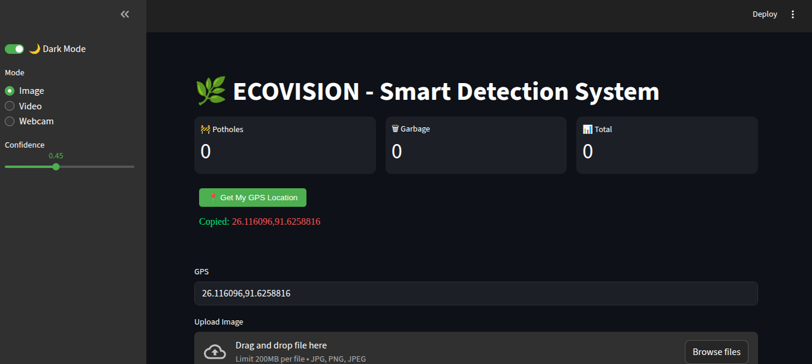
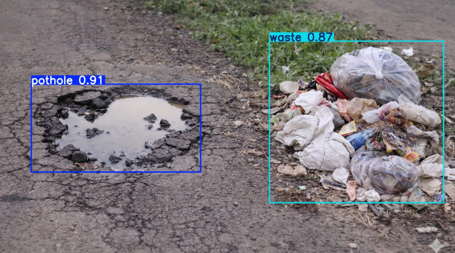
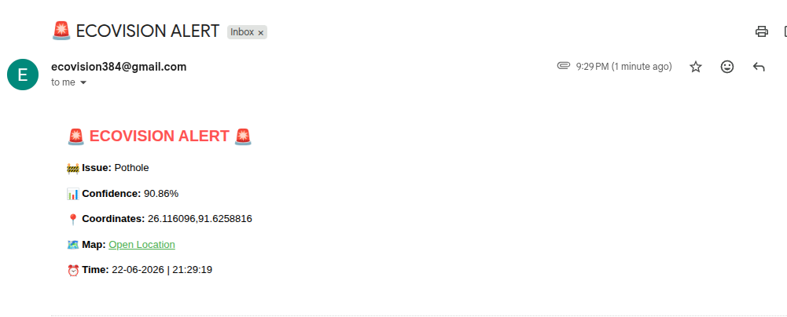

# EcoVision

## Smart Urban Issue Detection System Using Machine Learning

EcoVision is an AI-powered smart city solution designed to detect potholes, garbage, and sewage issues in urban areas using Computer Vision and Machine Learning.

### Features

* Pothole Detection
* Garbage Detection
* Sewage Detection
* Real-Time Object Detection using YOLOv8
* Streamlit-Based User Interface
* GPS-Based Location Tracking
* Automated Alert Generation
* Smart City Monitoring Support

### Technologies Used

* Python
* YOLOv8
* OpenCV
* Streamlit
* NumPy
* Pandas

### Project Workflow

1. Capture image/video/webcam input.
2. Process input using YOLOv8.
3. Detect potholes, garbage, and sewage.
4. Display detection results with confidence scores.
5. Generate alerts and location information.
6. Support smart-city monitoring and maintenance.

## Screenshots

### Dashboard

### Pothole Detection

### Email Alert

   

### Future Scope

* CCTV Integration
* Driver Warning System
* Night-Time Detection
* Heavy Rainfall Detection
* Mobile Application Integration
* Smart City Dashboard

### Author

Arman Banik
B.Tech Computer Science & Engineering
Royal Global University, Guwahati
